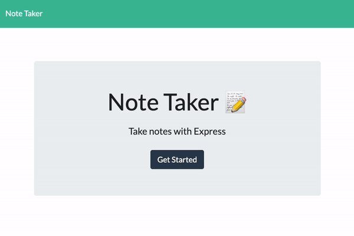

# Note Taker

## TABLE OF CONTENTS
* [Description](#description)
* [Usage](#usage)
* [Examples](#examples)
* [Questions](#questions)

## Description
A simple Node-based web app for storing and reviewing notes. Quickly and easily jot down your thoughts, reminders, or to-dos, then refer to them later (and delete them, if necessary) with a few clicks. 

## Usage
Click "Get Started" to be directed to your saved notes. Click on any saved note to view it, or click the pencil icon to start a new note. When finished, click the save icon to save the note to your saved notes. To delete a note, simply click the trash can icon. 

[Click here](https://boiling-taiga-50822.herokuapp.com/) to view the live application, hosted by Heroku servers.

## Examples:
Below demostrates the functionality:

## Questions?
Please direct all questions to cseibert2667@gmail.com, and be sure to check out my other projects at [cseibert2667](https://www.github.com/cseibert2667).
